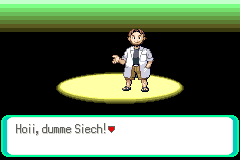
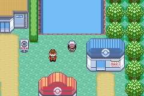

# Pokémon Emerald Swiss German Edition

Changes:

- play as Leaf / Red
- random Pokémon for wild encounters
- random Pokémon for all trainers
- no PP decrease
- better attacks for starters
- item prices all 1$
- first shop sells Rare Candies etc. for 1$
- first route can catch 3 starters, Mew
- can run indoors
- no uppercase names
- can teach TM / HM to any
- can forget HM
- repel effect *10

...it builds the following ROMs *(at least it did 2023-08-08)* 😐:

* pokeemerald.gba

...

...

...

To set up the repository, see [INSTALL.md](INSTALL.md).
